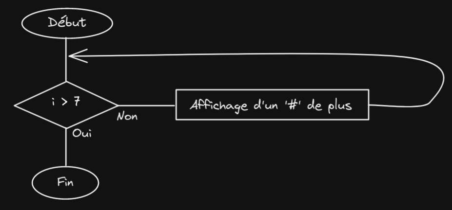

# Looping a triangle

Write a loop that makes seven calls to console.log to output following triangle<br>

## Algorigramme



## Pseudo-code

```
pyramide <- ''
Pour i de 1 jusque 7 avec un pas de 1 :
    ajout pyramide '#'
    affichage pyramide
Fin pour
```

## Code

```js
let pyramide = '';

for(let i = 0; i < 7; i++) {
    pyramide += '#';
    console.log(pyramide);
}

// Or

pyramide = '';

while(pyramide.length < 7) {
    pyramide += '#';
    console.log(pyramide);
}

```