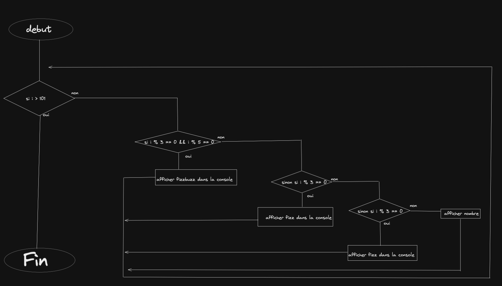

# FizzBuzz
 
Write a program that uses console.log to print all the numbers from 1 to 100, with two exceptions. For numbers divisible by 3, print "Fizz" instead of the number, and for numbers divisible by 5 (and not 3), print "Buzz" instead.

When you have that working, modify your program to print "FizzBuzz" for numbers that are divisible by both 3 and 5 (and still print "Fizz" or "Buzz" for numbers divisible by only one of those).

## Algorigramme




## Pseudo-code

```
pour i < 101 jusqu'a 100 avec un pas de 1
si i % 5 == 0 et non i % 3 == 0 
affichage buzz
sinon si i % 3 == 0 
affichage fizz
sinon si i % 5 == 0 et que i % 3 == 0
affichage fizzbuzz
sinon
afficher nombre
fin pour
```

## Code
```js
for(let i = 0 ; i<  101 ; i++){
 if (i % 5 == 0 && i % 3 == 0 ){
    console.log("FizzBuzz");
  }
  else if (i % 3 == 0){
    console.log("fizz")
  }
  else if (i % 5 == 0){
 console.log("buzz") 
  }
  else {
    console.log(i)
  }
}
```
