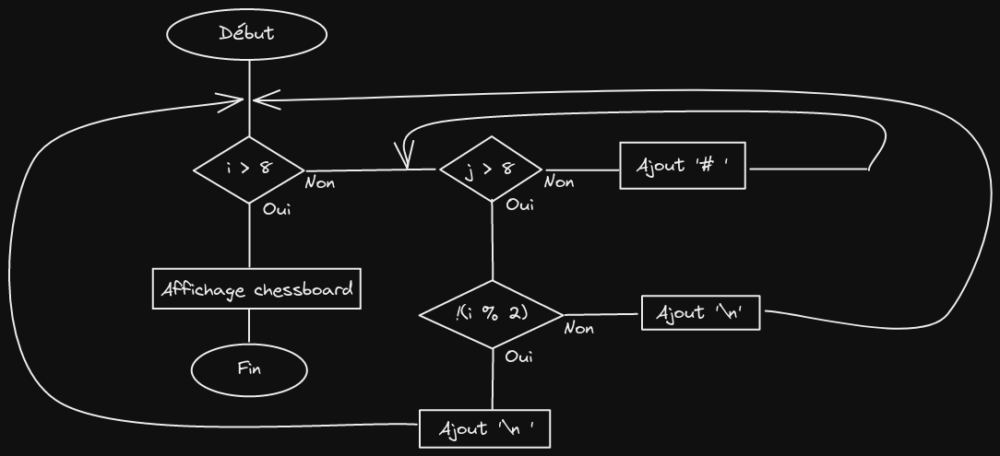

# Chessboard

Write a program that creates a string that represents an 8x8 grid, using newline characters to seperate lines. At each position of the grid there is either a space or a "#" character. THe characters should from a chessboard.

## Algorigramme

