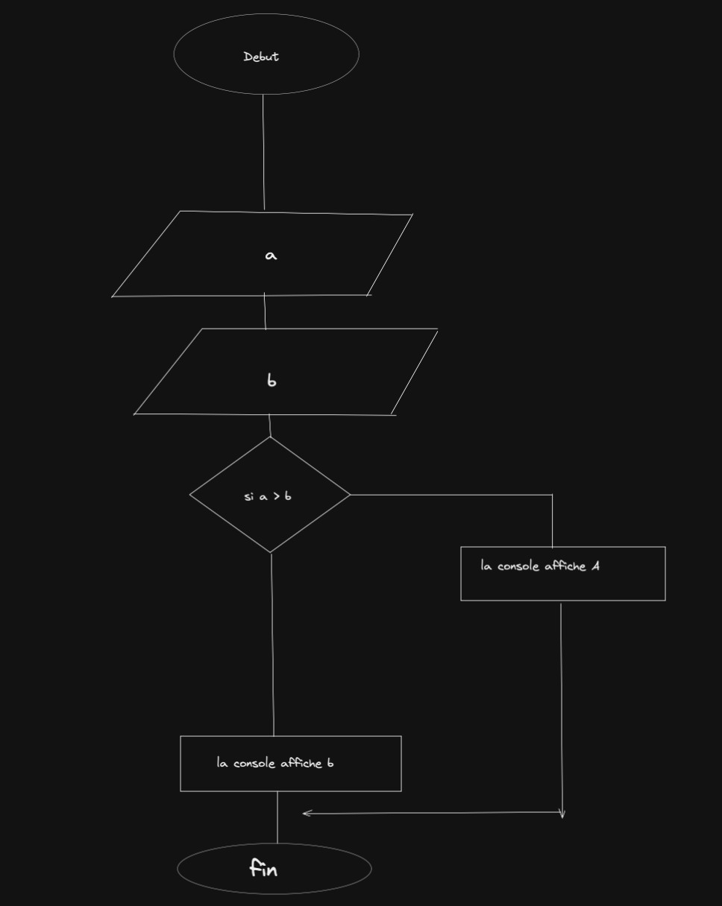

# Minimum


Write a function min that takes two arguments and returns their minimum.

## Algorigramme



## pseudo-code
```
erire a 
ecrire b 
    si a et superieur a b 
        afficher b 
    sinon si b et superieur a a 
        afficher a 
```
## code
```js
let a = 0;
let b = 1;
function nombre(a,b){
if (a > b){
    console.log(b);
}
else {
    console.log(a);
}}
nombre(a,b)
```
