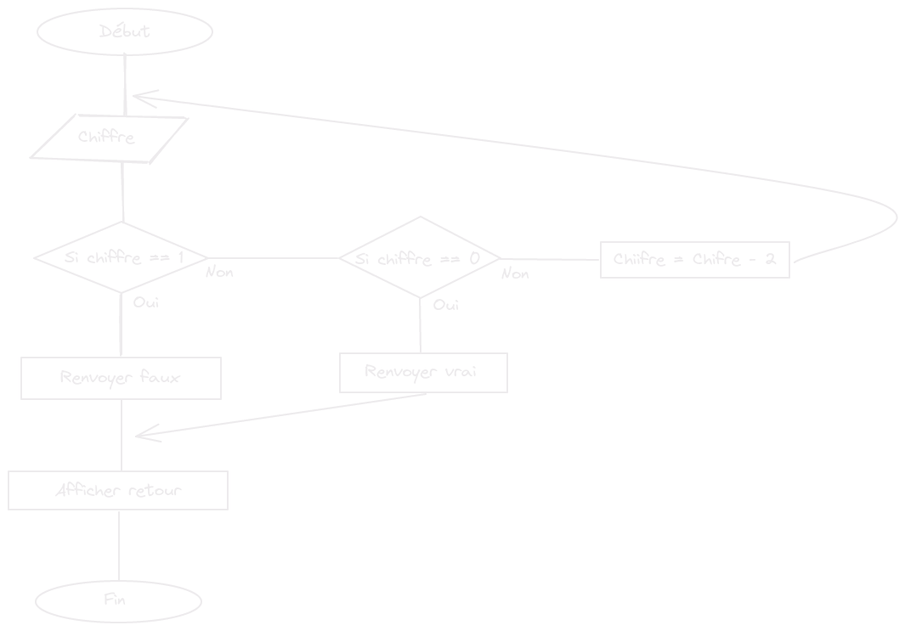

# Recursion


We’ve seen that % (the remainder operator) can be used to test whether a number is even or odd by using % 2 to see whether it’s divisible by two. Here’s another way to define whether a positive whole number is even or odd:

* Zero is even.
* One is odd.
* For any other number N, its evenness is the same as N - 2.

Define a recursive function isEven corresponding to this description. The function should accept a single parameter (a positive, whole number) and return a Boolean.

Test it on 50 and 75. See how it behaves on -1. Why? Can you think of a way to fix this?

## Algorigrame



## Pseudo-code

```
afficher isEven(x <- 50)
afficher isEven(x <- 75)

Fonction isEven (x)
    Si chiffre = 1 :
        retourner faux
    Sinon si chiffre == 0 :
        retourner vrai
    Sinon :
        Appelle isEven(x - 2) 

```